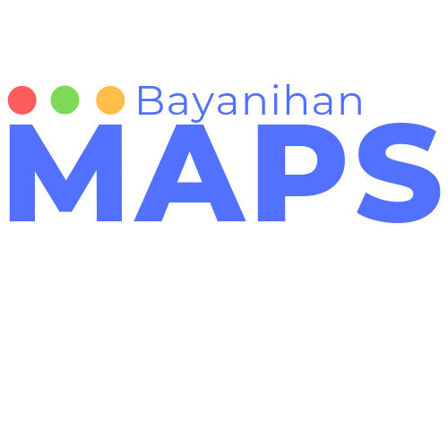

# A project for Solid Waste Management in the Philippines

This project is created with NativeScript and Angular for the hackathon describe here: https://ng-ns.org

## Mission and Future Plans

The Philippines is frequently rated as one of the least disciplined countries on garbage disposal. This leads to disasters such as flooding and landslides that further endanger millions of lives. Our project, Bayanihan Maps, aims to support NGOs and Local Government Units in their programs and/or policies on Solid Waste Management by enabling users to report locations that need improvement (Bad) and proper locations for garbage disposal (Good). The data that our app collects will be made open and accessible for analysis.

Future developments will encourage users to report by having gamification in the app and will also be able to generate intelligent insights by having big data analysis on the backend.

We'll also have a way to mark bad locations as "Resolved", after which the marker and rating will change.

We will also have a feature to facilitate "Clean up drives" where an organizer can specify an area in the map for the drive. The clean up drive can be "Joined" by users who want to join. There will be a "Scoring System" during a drive, and the organizers can "Add Rewards" for categories such as "Highest Score for Resolving Bad Areas" or "Highest Score for Reporting Bad Areas".

## Downloads

You can download the Android installer here: https://bit.ly/bayanihan-maps-downloads

## Using the App (Prototype)

The prototype right now is in Demo Mode: it generates mock data around the user's location, just to give you a feel of what the app will be when it has data.

1. Zoom out from your location to see all points.

2. Tap the HEAT button to see a Heat Map of all Bad locations. Note that the heat map is from the **Bad** points only, this is what the NGOs are more concerned with at the moment. We will have a switch to toggle Good or Bad in the future.

3. Tap the BACK button to see the Points Map again.

4. Hidden Feature: To toggle Demo Mode off or on, long press the "HEAT" button. *Warning:* Doing this will clear the data.

**NOTE:** Toggling the Demo Mode off and on again will regenerate some mock data around your location. You may want to do this to get an idea of how the Heat Map looks for different data sets.

5. Click "Add Point" to open the camera and report a garbage dump. (Another hidden feature for development: Long Press the "Add Point" button to clear the local storage photos array.)

6. After confirming the taken photo from the camera, the Details View will present you with "Bad!" and "Good!" buttons to rate the location. You can also "Cancel" if you want to.

7. On the Map View, tapping points will open a Details Dialog. This will show the rating and the time stamp of the reported location.

## Links 
Our current partner organization: UP PLANO 
https://facebook.com/UPplano/
http://upplano.org/

Our initial meeting notes: https://bit.ly/hack4goodph

[More details here](https://ayoayco.com/notes/bayanihan-basurahan).

